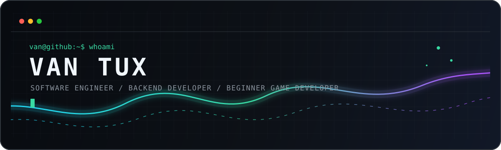

 

 

 

## <samp>01 // identity.config</samp>

<table>
  <tr>
    <td align="center" width="190"><b>NAME</b></td>
    <td align="left" width="520"><samp>Van Tux · @v4ntux</samp></td>
  </tr>
  <tr>
    <td align="center"><b>ROLE</b></td>
    <td align="left"><samp>Software Engineer · Backend Developer</samp></td>
  </tr>
  <tr>
    <td align="center"><b>NEW PATH</b></td>
    <td align="left"><samp>Beginner Game Developer — learning fundamentals step by step</samp></td>
  </tr>
  <tr>
    <td align="center"><b>BUILDING</b></td>
    <td align="left"><samp>APIs · Telegram bots · Mini Apps · automation</samp></td>
  </tr>
  <tr>
    <td align="center"><b>BASE</b></td>
    <td align="left"><samp>Tashkent, Uzbekistan · UTC+5</samp></td>
  </tr>
</table>

 

<table>
  <tr>
    <td width="33%" align="center" valign="top">
      <h3>⚙️ Backend</h3>
      APIs, business logic, databases, automation and Telegram ecosystems.
    </td>
    <td width="33%" align="center" valign="top">
      <h3>🎮 Game Dev</h3>
      A beginner exploring gameplay systems, loops, state and engine basics.
    </td>
    <td width="33%" align="center" valign="top">
      <h3>📚 Learning</h3>
      Game development, Go and NASM x86-64 fundamentals.
    </td>
  </tr>
</table>

## <samp>02 // stack.matrix</samp>

<table>
  <tr>
    <td align="center" width="160"><samp>MAIN</samp></td>
    <td align="left"></td>
    <td align="center"><samp>daily building</samp></td>
  </tr>
  <tr>
    <td align="center"><samp>FAMILIAR</samp></td>
    <td align="left">&nbsp;</td>
    <td align="center"><samp>worked with</samp></td>
  </tr>
  <tr>
    <td align="center"><samp>LEARNING</samp></td>
    <td align="left">&nbsp;&nbsp;</td>
    <td align="center"><samp>in progress</samp></td>
  </tr>
  <tr>
    <td align="center"><samp>ENVIRONMENT</samp></td>
    <td align="left"></td>
    <td align="center"><samp>build & ship</samp></td>
  </tr>
</table>

## <samp>03 // featured.deployments</samp>

<table>
  <tr>
    <td width="50%" align="left" valign="top">
      <h3>🪙 <a href="https://github.com/v4ntux/nCoin">nCoin</a></h3>
      Telegram-first P2P marketplace with escrow, trade chat, disputes, referrals, broadcasts and admin tools.
        
      
      
      
    </td>
    <td width="50%" align="left" valign="top">
      <h3>💍 <a href="https://github.com/v4ntux/wedding-app">Wedding App</a></h3>
      Telegram Web App for creating personal wedding invitations, templates and individual guest links.
        
      
      
      
    </td>
  </tr>
  <tr>
    <td width="50%" align="left" valign="top">
      <h3>🎲 <a href="https://github.com/v4ntux/nLuck">nLuck</a></h3>
      Group-first Telegram game bot with PvP modes, virtual economy, profiles and achievements.
        
      
      
    </td>
    <td width="50%" align="left" valign="top">
      <h3>🧱 <a href="https://github.com/v4ntux/nTask">nTask</a></h3>
      Concrete testing tracker with scheduled reminders, operational records and Telegram controls.
        
      
      
      
    </td>
  </tr>
</table>

## <samp>04 // telemetry.live</samp>

 

  

## <samp>05 // game_and_code.loop</samp>

<table>
  <tr>
    <td width="50%" align="center" valign="middle">
      <h3>LeetCode signal</h3>
      
    </td>
    <td width="50%" align="center" valign="middle">
      <h3>Game-dev checkpoint</h3>
      <samp>status: beginner</samp>  
      <samp>exploring:</samp> 
      game loops · state · input 
      gameplay systems · 2D basics  
      <code>learning by building</code>
    </td>
  </tr>
</table>

 

<picture>
  <source media="(prefers-color-scheme: dark)" srcset="https://raw.githubusercontent.com/v4ntux/v4ntux/output/github-contribution-grid-snake-dark.svg" />
  <source media="(prefers-color-scheme: light)" srcset="https://raw.githubusercontent.com/v4ntux/v4ntux/output/github-contribution-grid-snake.svg" />
  
</picture>

## <samp>06 // establish.connection</samp>

<table>
  <tr>
    <td align="center"><b>TELEGRAM</b></td>
    <td align="center"><b>LINKEDIN</b></td>
    <td align="center"><b>EMAIL</b></td>
    <td align="center"><b>LEETCODE</b></td>
    <td align="center"><b>INSTAGRAM</b></td>
  </tr>
  <tr>
    <td align="center"><a href="https://t.me/sd_van"><samp>@sd_van</samp></a></td>
    <td align="center"><a href="https://www.linkedin.com/in/vantux"><samp>vantux</samp></a></td>
    <td align="center"><a href="mailto:van.tux@yandex.com"><samp>send mail</samp></a></td>
    <td align="center"><a href="https://leetcode.com/u/VanTux/"><samp>VanTux</samp></a></td>
    <td align="center"><a href="https://instagram.com/va.ntux"><samp>@va.ntux</samp></a></td>
  </tr>
</table>

 

